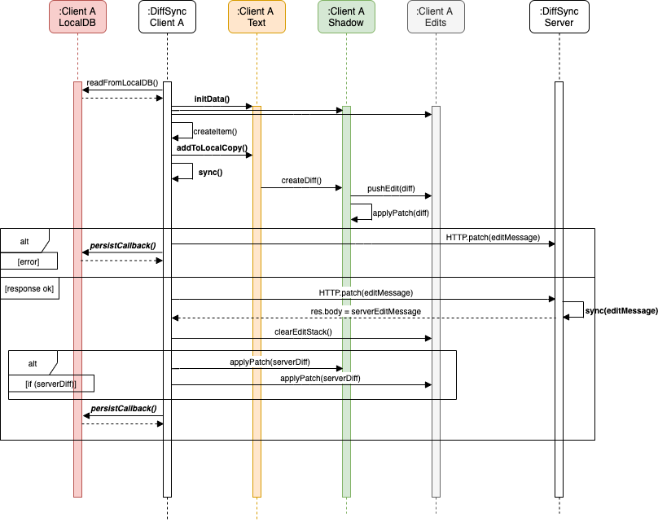
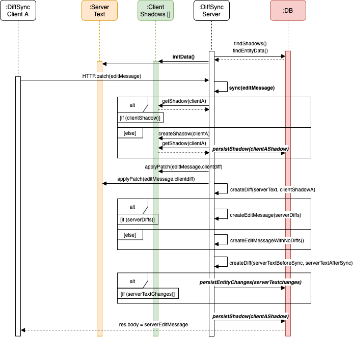
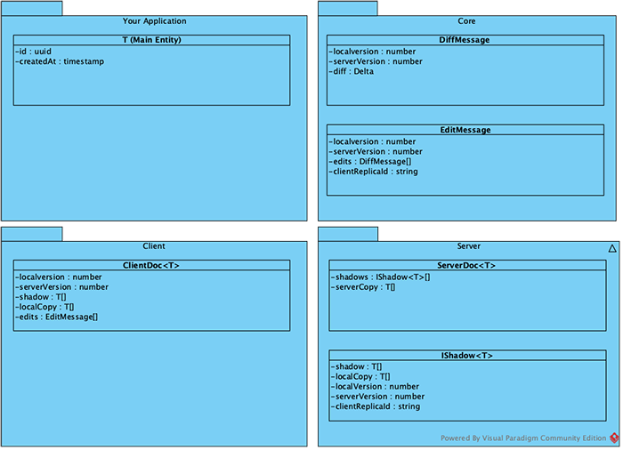

# diff-patch-sync

**diff-patch-sync** is a TypeScript library for syncing collaborative web-applications with REST-backends in order to make them offline-capable. 

Therefore the **Differential Synchronization** Algorithm developed by _[Neil Fraser](https://neil.fraser.name/writing/sync/)_ is being used. It enables synchronization of JSON-Objects using Benjamin Eidelmans _[jsondiffpatch](https://github.com/benjamine/jsondiffpatch)_ implementation (JSON Patch format RFC 6902) with the option to include semantic diffs using _[Google's Unidiff](https://github.com/google/diff-match-patch/wiki/Unidiff)_.

The lightweight API of diff-patch-sync will enable you to easily integrate Http-like **asymmetrical client-server-synchronization** into existing projects. It will help you to develop offline-first apps without changing the projects infrastructure.

## Table of contents

- [Setup](#setup)
- [Demo](#demo)
- [General](#general)
  - [Client Server Synchronization](#client-server-synchronization)
- [Data Model](#data-model)
- [Usage](#usage)
  - [Client](#client)
  - [Server](#server)
- [Tests](#tests)
- [References](#references)
- [Authors](#authors)
- [License](#license)

## Setup

Use npm package manager to install via:

- `$ npm i diff-patch-sync`

or clone repo and run locally:

- `$ npm install && npm run build`

## Demo

See a running demo of a collaborative todo-app containing **Angular 8** frontend and **NestJS** Rest backend on Node.js server. 

**[Demo Todo App](http://todo-app.w11k.de/)**

> **_Hint:_** It is recommended to use two different browsers (e.g. Chrome and Firefox) or two instances of Chrome (one instance in _private mode ("Ctrl + Shift + n")_) because IndexedDB is used and the instances should not share their databases.

## General

- The core of Differential Synchronization constists of _diffing_ and _patching_ objects.
- The synchronization takes place by sending requests via Http protocol. Keep in mind that the communication is assymetrical and it only syncs if the client requests for it. Though an interval mechanism could be added additionally to poll/sync data more often.
- Data which is transmitted over the network to the REST api consists of an EditsDTO object. It contains an _stack of diffs_ between the changed client's data copy and a shadow of the client's copy, as well as a _unique id_ per replica (client instance) and _version numbers_ respectively for the _local version_ and the _server version_ of the shadow.
- The version numbers are each updated when the sync is successful. There are a few reasons why they could not in sync any more: If the request gets lost the server version number will not be incremented, though the clients knows that the diff has not been applied to the server and he sends the changes in the next sync cycle.
- Only one sync cycle: On slow internet connections it could theoretically occour, that two request are fired before the first roundtrip has been finished. The second request will be prevented and the changes will be send with the next sync cycle because of otherwise the version numbers will get mixed up.


- The concrete Diffferential Synchronization algorithm by Neil Fraser is shown in the figure below.

![Differential Synchronization Algorithm [https://neil.fraser.name/writing/sync]](assets/images/differential_synchronization_guaranteed_delivery.png "Differential Synchronization Algorithm")

Here's how the Client-Server-Synchronization works:
 
### Client-Server-Synchronization

1. On initial load the clients data copy and local shadow are empty. 
2. First the client fetches data from server. On the first request a new shadow per client will be created on the server.
3. The response will be the diff between the empty shadow and the servers copy. This returns the whole dataset.
4. The diff will be applied on the clientside.
5. A callback function makes it possible to persist the data locally, each time an error occours during network communication or when the response successfully arrives.
6. Every time making changes on the client and thus changing the local data copy, the diff between the local data copy and the local shadow will be send to the server.
7. Next the patch will be applied to the clients shadow on the server. 
6. Before the servers data copy will be patched with the clients diff as well, a diff between the servers data copy and the will be taken.
8. If the diff is not empty, the changes will be added to the response.
9. A callback function is being offered to persist the client shadow serverside. 
10. Before the sync finishes on the server, the entire changes of the server document during the sync cycle are determined to be able to reflect the changes to the main entity on the servers database. Therefore callback functions are provided to update the servers database.

- The **client** implementation of the algorithm can be seen in the sequence diagram below:
    


- Compared to the client, the **server** implementation is stateless. The following sequence diagram shows in which sequence the algorithm loads, synchronizes and persists the data from the database after the HTTP request has arrived.



## Data Model

The _ClientDoc_ and the _ServerDoc_ classes represents the data to be persisted respectively clientside and serverside:



## Usage

### Client

The client-side implementation of the DS algorithm is represented by the TypeScript class 'DiffPatchSyncClient'. An instance of the client is instantiated as follows. The generic type variable for the desired entity is passed to the class.

````{caption="DiffPatchSyncClient - Instanziierung"}
const client: DiffPatchSyncClient<Todo> = new DiffPatchSyncClient(syncWithServerCallback, dataAdapter, diffPatchOptions);
````

A callback function for the API call to the REST backend is passed as a parameter with the following signature:

````{caption="Signatur für API-Call"}
syncWithRemoteCallback: (editMessage: EditsDTO) => Promise<EditsDTO>;
````

#### Persistence

The second parameter during instantiation is an object of type 'LocalStoreAdapter', which contains the implementation for the callback functions for the client-side persistence layer. The functions can be integrated by implementing the signatures in the relevant class. The callback function 'storeLocalData' is called after each synchronization cycle and the function 'getLocalData' before or during initialization.

````{caption="Interface für clientseitige Persistenz"}
interface LocalStoreAdapter<T> {
    storeLocalData(document: ClientDoc<T>): Promise<any>;
    getLocalData(): Promise<ClientDoc<T>>;
}
```` 

#### Initialize data

Second the client is initialized with the persisted data using the 'initData()' method. The client then executes the 'getLocalData()' callback function. If no data has been persisted before and the return value is 'undefined', a new document of type 'ClientDoc' is created.

````{caption="DiffPatchSyncClient - Daten initialisieren"}
await client.initData();
````

#### Add data

To add a new entry to the document, the 'create()' method is used:

````{caption="DiffPatchSyncClient - Eintrag hinzufügen"}
const newTodo: Todo = { 
    title: 'This is a new entry', 
    id: 'new-generated-entry-id' 
};

client.create(newTodo);
````

#### Delete data

To remove an entry from the document, the 'remove()' method is used:

````{caption="DiffPatchSyncClient - Eintrag löschen"}
const toBeRemovedItem: Todo = { 
    title: 'This entry should be deleted', 
    id: 'to-be-deleted-entry-id' 
};

client.remove(toBeRemovedItem);
````

It is also an option to delete an entry by ID:

````{caption="DiffPatchSyncClient - Eintrag per ID löschen"}
const idToBeRemoved: string = 'to-be-deleted-entry-id';

client.removeById(idToBeRemoved);
````

#### Update data

To update an entry from the document, the 'update()' method is used:

````{caption="DiffPatchSyncClient - Eintrag aktualisieren"}
const toUpdateItem: Todo = { 
    id: 'to-be-updated-entry-id', 
    title: 'This is an entry' 
};
const updatedItem: Todo = { 
    id: 'to-be-updated-entry-id', 
    title: 'This is the updated entry' 
};

client.update(toUpdateItem, updatedItem);
````

It is also an option to update an entry by ID:

````{caption="DiffPatchSyncClient - Eintrag per ID aktualisieren"}
const idToBeUpdated: string = 'to-be-updated-entry-id';
const updatedItem = { 
    id: 'to-be-updated-entry-id', 
    title: 'This is the updated entry' 
};

client.updateById(idToBeUpdated, updatedItem);
````

#### Synchronize data

After the status of the client document has changed, the changes must be transferred to the shadow and synchronized with the server. There are two options to do this:

- Synchronize periodically (Observable-based):

````{caption="DiffPatchSyncClient - Daten periodisch synchronisieren"}
client.syncPeriodically(2000);

const syncedDoc: Observable<Todo[]> = client.subscribeToChanges();

````

- Synchronize on changes (Promise-based):

````{caption="DiffPatchSyncClient - Daten synchronisieren"}
const syncedDoc: Promise<Todo[]> = client.sync();
````

### Server

The server side implementation of the DS algorithm is represented the by the TypeScript class 'DiffPatchSyncServer'. An instance of the server is instantiated as follows. The generic type variable for the desired entity is passed to the class.

````{caption="DiffPatchSyncServer - Instanziierung"}
const server: DiffPatchSyncServer<Todo> = new DiffPatchSyncServer(dataAdapter, diffPatchOptions);
````

The parameter during instantiation contains an object of type 'PersistenceAdapter' that contains the implementation for the callback functions for the server-side persistence layer.

### Persistence

The server-side persistence is implemented as follows: Separate callbacks are executed for the respective entity to be synchronized and the shadow entity. During a synchronization cycle, all database operations should be available for these entities. As shown in the sequence diagram above, the current state of the data is loaded from the database before each data synchronization. After synchronization, the data is persisted. Callbacks are provided by the library for this purpose. A call of the function corresponds to a database query for the named entity.

The functions can be defined by implementing the following signatures in the relevant class:

````{caption="Interface für serverseitige Persistenz"}
interface PersistenceAdapter<T> {
    findShadowById(clientReplicaId: string): Promise<Shadow<T>>;
    saveShadow(shadow: Shadow<T>): Promise<any>;
    updateShadow(shadow: Shadow<T>): Promise<any>;
    deleteShadow(shadow: Shadow<T>): Promise<any>;

    findAllItems(): Promise<T[]>;
    saveItem(item: T): Promise<any>;
    updateItem(item: T): Promise<any>;
    deleteItem(item: T): Promise<any>;
}
````

### Synchronize Data

After the response arrives at the servers REST endpoint, the 'sync()' method is called. The corresponding data exchange object of the request is passed as a parameter. After the data has been synchronized, this method returns a promise of the data exchange object, which will be returned to the client with the HTTP-response.

````{caption="DiffPatchSyncServer - Daten synchronisieren"}
const serverMessage: Promise<EditsDTO> = server.sync(clientMessage);
````

## Testing

Running unit tests: 
```bash
$ npm i
$ npm run test
$ npm run coverage
```

## References

* [jsondiffpatch](https://github.com/benjamine/jsondiffpatch) - Diff & patch JavaScript objects.
* [diff-match-patch](https://github.com/google/diff-match-patch) - Diff Match Patch is a high-performance library in multiple languages that manipulates plain text. 
* [lodash](https://github.com/lodash/lodash) - A modern JavaScript utility library delivering modularity, performance, & extras.
* [uuid](https://github.com/uuidjs/uuid) - Generate RFC-compliant UUIDs in JavaScript.

## Authors

* **Mario Sallat** - [Github](https://github.com/msallat)

## License

This project is licensed under the _Apache-2.0_ License - see the [LICENSE.md](LICENSE.md) file for details